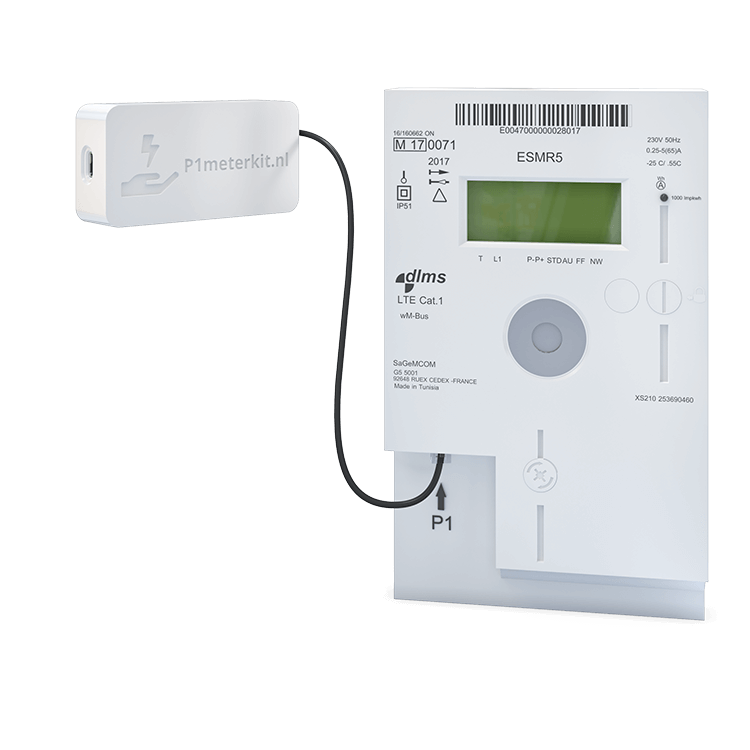

# P1MeterKit for Home Assistant / ESPHome

P1MeterKit is a compact ESPHome-based smart meter reader for Home Assistant. It reads DSMR telegrams from the P1 port and exposes electricity, gas, and environmental data locally, with optional cloud-sync firmware variants where needed.

Product page: https://p1meterkit.nl/en

## How It Works

P1MeterKit connects directly to the P1 port of a DSMR smart meter with an RJ12 cable. It reads the incoming telegrams and publishes the data to Home Assistant through ESPHome.

## Key Features

- Real-time electricity consumption and production monitoring
- Gas monitoring through the meter's M-Bus data
- Temperature and humidity measurement
- Fully local operation by default
- WiFi onboarding with captive portal support
- Optional cloud-sync firmware variants

## Hardware Versions

| Version | Chip | Connectivity | Description |
|---------|------|--------------|-------------|
| V1 | ESP8266 | WiFi | Original compact P1MeterKit hardware |
| V2 | ESP32-C3 | WiFi | Updated hardware with Improv BLE and Improv Serial provisioning |

## Variants

We publish firmware for two hardware revisions. Each customer-facing variant has its own YAML file and matching Web Tools manifest.

| Hardware | Variant | Description |
|----------|---------|-------------|
| V1 (ESP8266) | WiFi | Standard WiFi connectivity |
| V1 (ESP8266) | WiFi Cloud | WiFi with optional SmartHomeShop cloud sync |
| V2 (ESP32-C3) | WiFi | WiFi with Improv BLE and Improv Serial |
| V2 (ESP32-C3) | WiFi Cloud | WiFi with optional SmartHomeShop cloud sync |

## Sensors

| Sensor | Description |
|--------|-------------|
| Energy Consumed Tariff 1/2 | Total energy consumed per tariff |
| Energy Produced Tariff 1/2 | Total energy returned per tariff |
| Power Consumed | Current electricity usage |
| Power Produced | Current electricity production |
| Voltage Phase 1/2/3 | Voltage per phase |
| Current Phase 1/2/3 | Current per phase |
| Gas Consumed | Total gas consumption |
| Temperature | Environment temperature |
| Humidity | Environment humidity |
| WiFi Signal | WiFi signal strength |

## Getting Started

1. Connect the kit to the smart meter with the included RJ12 cable.
2. Flash the desired firmware with the web flasher or ESPHome CLI.
3. If WiFi is not configured yet, connect to the fallback hotspot.
4. On V2, you can also provision over Improv BLE or Improv Serial.

Web flasher: https://smarthomeshop.io/en/firmware
Quick start guide: https://smarthomeshop.io/quick-start-p1meterkit

## Version History

- GitHub Releases: https://github.com/smarthomeshop/p1meterkit/releases

## Repository Layout

- `p1meterkit-v1/` — ESPHome configurations for V1 (ESP8266)
- `p1meterkit-v2/` — ESPHome configurations for V2 (ESP32-C3)
- `.github/workflows/` — build and publish automation for firmware and manifests
- `gh-pages` branch — public firmware files and manifests

## Contributing

PRs and issues are welcome. Please keep changes modular and follow ESPHome best practices.

## Support

- Product info and guides: https://p1meterkit.nl/en
- Store: https://smarthomeshop.io
- Community and support: https://smarthomeshop.io/discord

## License

This project is released under the CC BY-NC 4.0 license.
